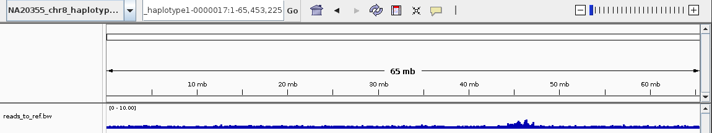

# CUT&RUN ONT workflow
[](https://github.com/logsdon-lab/Snakemake-CutNRun/actions/workflows/main.yaml)

Workflow to do the following:
1. Trims adapters
2. Filters reads between 100 - 10kbp
3. Aligns with bwa-mem
4. Normalizes to sample_baseline and generate bigWig for visualization.



> Normalized CENP-A enrichment in HGSVC NA20355_chr8_haplotype1-0000017   

## Getting Started
Clone the repo.
```bash
git clone https://github.com/logsdon-lab/Snakemake-CutNRun.git
cd Snakemake-CutNRun
```

Create conda environment with Snakemake.
```bash
conda env create --name smk snakemake==9.5.0
```

## Configuation
Modify to fit your use-case.
* Expects a baseline to compare treatment enrichment against.
* Only one sample possible.

```yaml
ref: data/asm/asm.fa
sample_baseline: IgG
samples:
  CENP-A:
    path: data/CENP-A/reads.bam
  IgG:
    path: data/IgG/reads.bam
```

## Run
To run the workflow and install necessary dependencies with conda.
```bash
snakemake -np --configfile config.yaml -c 12 --sdm conda
```

## Output
Normalized `bigWig` file under `results/(!sample_baseline)/reads_to_ref.bam`.
* ex. `results/CENP-A/reads_to_ref.bam`
* This can be loaded in `IGV` with the aligned reference.

## Test
Run test case of CENP-A enrichment in HGSVC NA20355_chr8_haplotype1-0000017.
```bash
# Note: Reads subset for testing purposes.
# See docs/IGV_NA20355_chr8_haplotype1-0000017_no_subset.png
snakemake -p --configfile test/config.yaml -c 12 --sdm conda
```

## Cite
**Gao S, Oshima KK**, Chuang SC, Loftus M, Montanari A, Gordon DS, Human Genome Structural Variation Consortium, Human Pangenome Reference Consortium, Hsieh P, Konkel MK, Ventura M, Logsdon GA. A global view of human centromere variation and evolution. bioRxiv. 2025. p. 2025.12.09.693231. [doi:10.64898/2025.12.09.693231](https://doi.org/10.64898/2025.12.09.693231)
