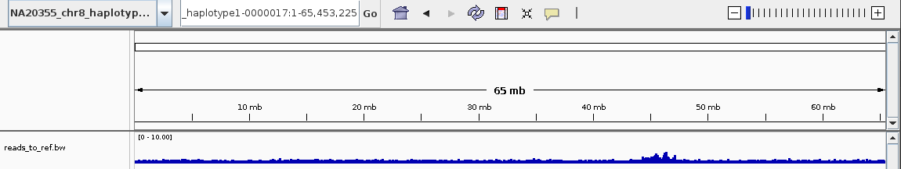

# CUT&RUN ONT workflow
[](https://github.com/logsdon-lab/Snakemake-CutNRun/actions/workflows/main.yaml)

Workflow to do the following:
1. Trims adapters
2. Filters reads between 100 - 10kbp
3. Aligns with bwa-mem
4. Normalizes to sample_baseline and generate bigWig for visualization.



> Normalized CENP-A enrichment in HGSVC NA20355_chr8_haplotype1-0000017   

## Getting Started
Clone the repo.
```bash
git clone https://github.com/logsdon-lab/Snakemake-CutNRun.git
cd Snakemake-CutNRun
```

Create conda/pixi environment with Snakemake.
```bash
conda create --name smk bioconda::snakemake==9.5.0
# Or with pixi
pixi install
```

## Configuation
Modify to fit your use-case. See `examples/*.yaml`.
* Multiple samples are supported. 
* Primer list for CUT&RUN kit is listed in `data/14-1001-cut-and-run-library-prep-kit-primers.csv` but can be modified if necessary. Use a matching index.
* Multiple BAMs will be merged and then trimmed. If multiple primer pairs are set, all will be trimmed.

Here's one minimal example:
```yaml
# Mapping of idx to primer sequence
primer_list: data/14-1001-cut-and-run-library-prep-kit-primers.csv
samples:
  # sample name
  sample_1:
    # Reference genome to align to.
    ref: data/asm/asm.fa
    data:
      treatment:
        # Primer list (list[list[str]] or list[str])
        # NOTE: If multiple paths, primer pairs are compared against merged reads.
        primer:
        - ["idx_i5*", "idx_i7*"]
        # Path to unaligned BAM data
        path: data/CENP-A/reads.bam
      control:
        primer:
        - ["idx_i5*", "idx_i7*"]
        - ["idx_i5*", "idx_i7*"]
        path: [
          data/IgG/reads1.bam,
          data/IgG/reads2.bam,
        ]
```

## Run
To run the workflow and install necessary dependencies with conda.
```bash
snakemake -np --configfile config.yaml -c 12 --sdm conda
```

With `pixi`:
```bash
pixi run snakemake --configfile test/config.yaml -c 8 -p --sdm conda
```

## Output
Normalized `bigWig` file under `results/bam/reads_to_ref.bw`.
* ex. `results/{sample}/bam/reads_to_ref.bw`
* This can be loaded in `IGV` with the aligned reference.

## Test
Run test case of CENP-A enrichment in HGSVC NA20355_chr8_haplotype1-0000017.
```bash
# Note: Reads subset for testing purposes.
# See docs/IGV_NA20355_chr8_haplotype1-0000017_no_subset.png
snakemake -p --configfile test/config.yaml -c 12 --sdm conda
```

## Cite
**Gao S, Oshima KK**, Chuang SC, Loftus M, Montanari A, Gordon DS, Human Genome Structural Variation Consortium, Human Pangenome Reference Consortium, Hsieh P, Konkel MK, Ventura M, Logsdon GA. A global view of human centromere variation and evolution. bioRxiv. 2025. p. 2025.12.09.693231. [doi:10.64898/2025.12.09.693231](https://doi.org/10.64898/2025.12.09.693231)
